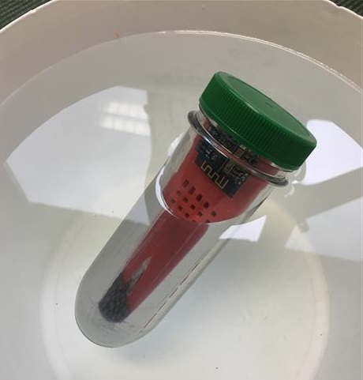
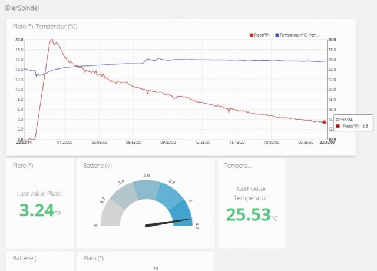
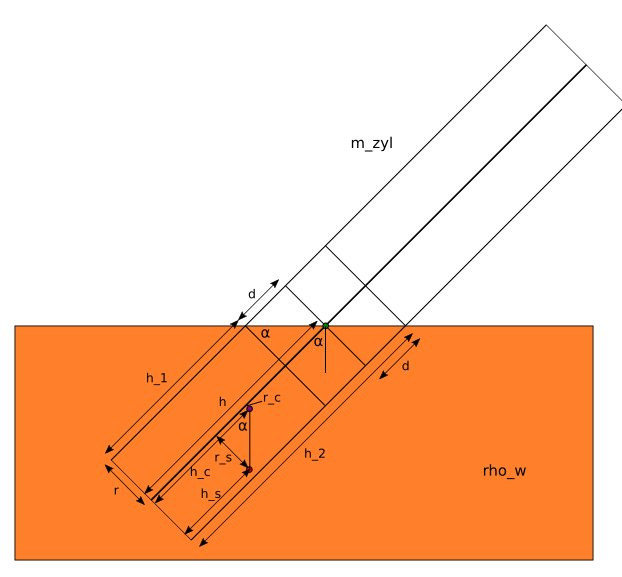
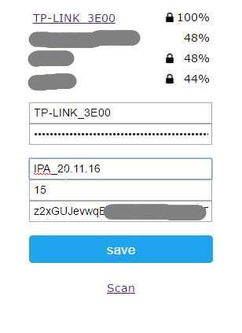
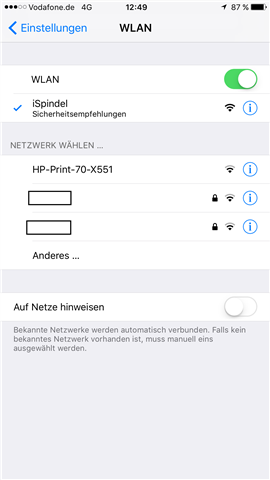
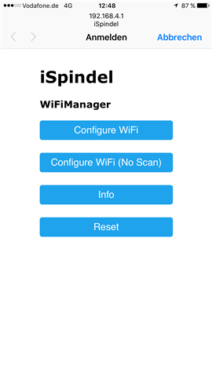
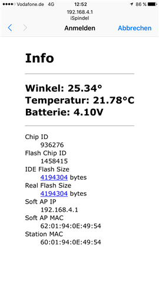

iSpindel | iSpindle
===================

**DIY elektronische Bierspindel | electronic Hydrometer**
***https://universam1.github.io/iSpindel***

***

## Documentation in other languages

### [English Documentation (work in progress)](docs/README_en.md) :us:
### [Nederlandse Vertaling (lopende werkzaamheden)](docs/README_nl.md) 

***

***If you like it say thanks with a beer*** :beers:

***

## News

> 25.12.16 Kit   
> 23.12.16 CraftBeerPi Info, FW.3.4.4, Combo-Schlitten   
> 18.12.16 FAQ und Ubidots tool  
> 15.11.16 Firmware 3.4.2:
>- Supporting now backends
>   - CraftBeerPi
>   - TControl
>   - FHEM
>   - generic HTTP
>- major Portal rework, added labels for convenience
>- upload speed improvements
>- Power saving on empty battery
>- added custom Battery conversion factor
>- Bugfixes

> 11.12.16 Sources and drawer online  
> 11.12.16: FHEM upload documentation & firmware (thanks @MSBannert!)  
> 07.12.16: Schematics  
> 3.12.16: Firmware 2.1.2 Wifi improvements  
> 9.11.16: Calibration and Excel sheet for conversion to Plato, SG etc.  

***

> The `iSpindle` is a young project and under heavy development, see german [Hobbybrauer.de Thread](http://hobbybrauer.de/forum/viewtopic.php?f=7&t=11235).  Contribution and support is appreciated especially regarding creation and translation of documentation. Feel free to provide a `pull request`.  
>
> Die `iSpindel` befindet sich zur Zeit mitten in der Entwicklung, siehe dazu [den Hobbybrauer.de Thread](http://hobbybrauer.de/forum/viewtopic.php?f=7&t=11235). Mithilfe ist herzlich willkommen und Ergänzungen bitte per Pull Request einreichen. Großes Dank an alle die Unterstützung leisten seitens Grundlagen erarbeiten oder passende Hardware zu finden.

## Inhaltverzeichnis

- [Lizenz](#lizenz)
- [Prinzip](#prinzip)
  - [Metazentrum](#metazentrum)
- [Aufbau](#aufbau)
  - [Varianten](#varianten)
  - [Bauteile](#bauteile)
  - [Schaltplan](#schaltplan)
  - [Schlitten](#schlitten)
- [Konfiguration](#konfiguration)
  - [Ubitdots](#ubitdots)
  - [Portal](#portal)
  - [Scripting](#scripting)
- [Anzeige](#anzeige)
  - [Kalibrierung der Spindel](#kalibrierung)
  - [Ubidots Graphen](#ubidots-graphen)
  - [CraftBeerPi](#craftbeerpi)
  - [FHEM](#fhem)
- [FAQ](docs/FAQ.md)
- [Software](#software)

***

## Lizenz

> Jeglicher kommerzieller Nachbau oder Verwendung ist prinzipiell untersagt. Geltende Patente werden verletzt.
>
> All rights reserverd, any commercial use is hereby prohibited and will violate applicable patents.

***

## Prinzip

Angetrieben von dem Thread [Alternative zu Spindel](http://hobbybrauer.de/forum/viewtopic.php?f=7&t=11157&view=unread#p170499) wurde die Idee geboren die kommerziell erhältliche elektronische Bierspindel nachzubauen.

Die Idee des krängende Zylinders ist genial wie einfach - man braucht keine externe Referenz (außer der Erde) und der Zylinder ist extrem leicht sauber zu halten. Der Neigungswinkel ändert sich im Verhältnis zum Auftrieb und damit im direkten Zusammenhang mit dem Zuckergehalt.
Kein unnötiges Öffnen zum spindeln und evtl. Kontaminieren!

Daher die Idee, ein IoT device mit Wifi zusammen mit einem Beschleunigungssensor und Temperatursensor in einen schwimmenden Zylinder zu legen. Dort wacht er alle bsp. 5min auf, verbindet sich mit meinem Wlan und sendet seinen Neigungswinkel, Temperatur und Akkuspannung an einen Cloudservice. 

### *Metazentrum*

Eigentlich dreht es sich hier um das "Metazentrum", der Zylinder wird solange rotieren bis das Metazentrum im Lot zum Auftriebspunkt ist. Diesen Wert messen wir.

Man kann insofern trimmen, dass man am Boden ein paar Gramm hinzufügt, damit stellt sich der Zylinder mehr auf, oder am Deckel, damit krängt er mehr. 

In der Software berechnent man aus den XYZ Beschleunigungswerten den Euler Winkel für X und Y und bildet daraus den Absolutwinkel. Diesen verrechnen wir mit den kalibrierten Eckwerten zum °Plato.

***

## Aufbau

### Varianten

> Alle drei Varianten sind funktionell identisch

1. [Variante A: Lochrasterplatine & Schlitten](docs/iSpindelbreadboard.md)  
Die Lochrasterplatine ermöglicht den Nachbau jederzeit mit 'Hausmitteln' 
1. [Variante B: nur Platine](docs/iSpindelPCB.md)  
Die fertige Platine über die Sammelbestellung bringt einen komfortablen Aufbau
1. [Variante C: Platine & Schlitten](docs/iSpindelPCB.md)  
Die obige Platine kann (über Trenn-Schnitt) mit dem Kunstoff Schlitten in Kombination verwendet werden der einen spielfreien Sitz garantiert.

### Bauteile

***siehe [Bauteile](docs/Parts.md)***

### Schaltplan

***siehe [Schaltplan](docs/Schaltplan.md)***

### Schlitten

***siehe [Bauteile](docs/Parts.md)***

***

## Konfiguration

### Ubitdots

- Zu Beginn muss ein kostenloser Account bei [Ubidots.com](https://ubidots.com) erstellt werden
- Im Menü  `API Credentials` erhält man seinen `Token` durch das die iSpindel die Berechtigung zum Schreiben der Daten erhält.  
***Diesen notieren.***  

### Portal

Durch mehrmaliges Drücken der `Reset Taste` erstellt der Wemos einen AccessPoint, mit dem verbunden man die nötigen Einstellugen vornehmen kann.

> Die `iSpindel` signalisiert dass sie sich im *Konfiguration-Modus* druch permanentes Blinken im Sekundentakt.  
Man verlässt den *Konfiguration-Modus* durch speichern seiner Einstellungen, durch betätigen des Menüpunkts `Start iSpindel` oder durch warten von 5 Minuten. Danach befindet sie sich im *Betriebsmodus* d.h. sie sendet ihre Daten und geht daraufhin direkt in den "Deep Sleep" Standby Modus. Daher ist sie im normalen Modus nicht erreibar.

- Der Ubidots  `Token` ~~und die  `IDs`~~, welche man oben notiert hat, werden nun an dieser Stelle eingetragen.  

- Ebenfalls stellt man hier den `Intervall` ein in dem sie Daten liefert. Dies hat direkt mit der Akku Lebensdauer zu tun. Es empfiehlt sich in der Praxis etwa `1800` Sekunden (= 30 Minuten) Takt zu wählen.

   

- Man erreicht es über

   

- Eine Übersicht der Daten kann man über den `Info` Menüpunkt einsehen

  

Nach dem man obige Daten eingetragen und gespeichert hat, wird die Spindel sich mit dem Wlan und Ubidots verbinden und die Daten übertragen.  
Falls noch nicht vorhanden, wird selbständig ein neues `Device` erstellt und die Sensoren angelegt.  
Auf der Ubidots Weboberfläche wird man nun unter `Sources` sehen dass die Daten aktualisiert werden.  

Nun kann man im `Dashboard` sich seine Graphen nach Belieben zusammenstellen.

### Scripting

Ubidots kann ausserdem an vielen Stellen per Script bedient werden. Eine Dokumentation zu den Funktionen findet sich direkt bei Ubidots. Hiermit können zum Beispiel nicht mehr benötigte Daten in Variablen gelöscht werden.

- [siehe Ubidots-Scripting](docs/ubidotsscripting.md)

***
## Anzeige

### Kalibrierung

> Zur Umrechnung von Winkel ° in °Plato, SG, %mas o.Ä. ist es initial nötig eine Referenzkurve zu kalibrieren. Die gewonnenen Referenzen können dann vereinfacht über eine Excel Tabelle in eine Funktion überführt werden, die zur Darstellung hinterlegt wird. Da jede selbstgebaute Spindel andere Messwerte ergeben wird, muss man diesen Prozess einmalig durchführen.

[siehe Kalibrierung durchführen](docs/Kalibrierung.md)

### Ubidots Graphen

- [Plato Formel](docs/Kalibrierung.md#formel)

### CraftBeerPi

> Beschreibung von @not:  
*Wenn Du die neueste Firmware auf Deine iSpindel geflasht hast musst Du auch craftbeerpi updaten: dazu brauchst Du den branch "hydrometer". Wenn Du die Spindel dann konfigurierst, gibst Du neben den Einstellungen für Dein WLAN im Dropdown-Menu "CraftbeerPi" an und darunter die IP Adresse Deines im selben Netzwerk gelegenen Craftbeerpi-Servers.
Danach sendet die Spindel an den Raspberry Pi -Rechner und Craftbeerpi registriert die Spindel automatisch . Wenn die Verbindung klappt, findest Du die Spindel "wie von Geisterhand" in der Hardware-Konfiguration von CBP.
Du siehst, dass Daten ankomen, wenn Du Deine Fermentation / Gärung im CBP anschaust, da sind dann nicht nur die Temperatur (ist und soll) , sondern auch Spindeltemperatur und Plato zu sehen (siehe Screenshot oben) mit letztem Zeitstempel.*  
`git clone -b hydrometer https://github.com/Manuel83/craftbeerpi.git`

### FHEM

- [upload zu FHEM](docs/upload-FHEM.md)

***

## Software 

### Firmware flashen

***Getestet***

- [Firmware flashen](docs/Firmware.md)

### Compile from Source

***Development***
> The sources represent the current development state thus being untested or at times even broken. Use the provided .bin files for your brew.

- [Compile from source](docs/compile.md)

***Gefällt es dir, na dann spende mir halt ein Bier***  :beers:

