# Aufbau Variante A: Lochrasterplatine & Schlitten

> Die Ansicht der Bilder ist immer ***links*** zeigt Richtung Deckel / USB Anschluss des Wemos.

1. Pin Stiftleiste von unten durchstecken. Dadurch reduzieren wir die Aufbauhöhe damit alles in den Petling passt.  
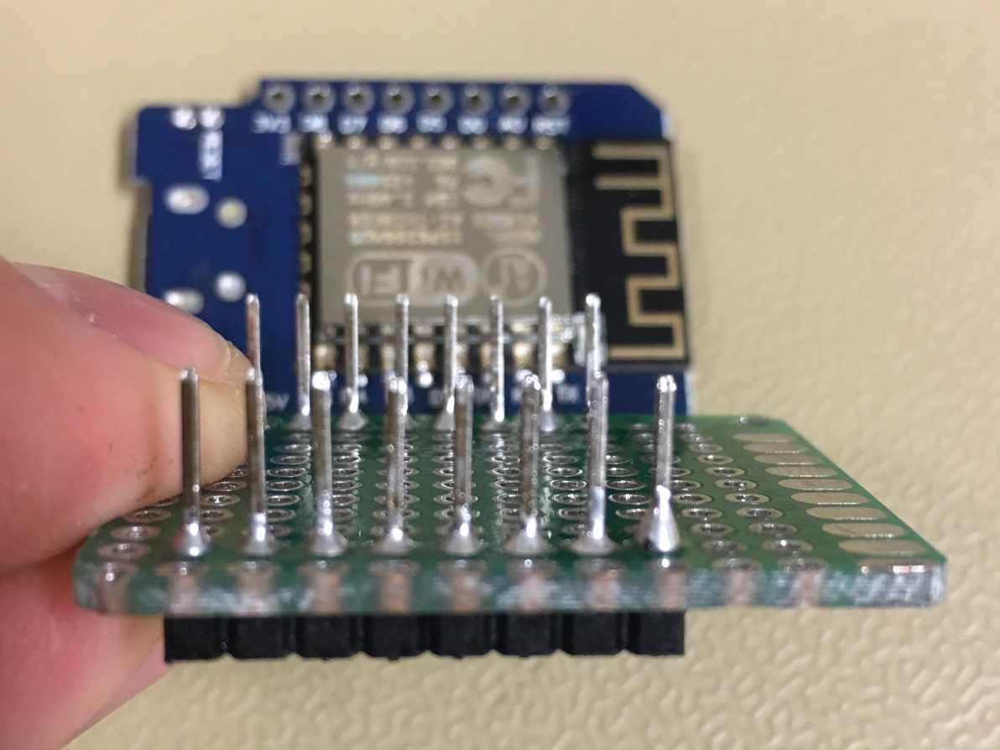  
1. Kurze und lange Buchsenleiste aufstecken und Wemos verlöten.  
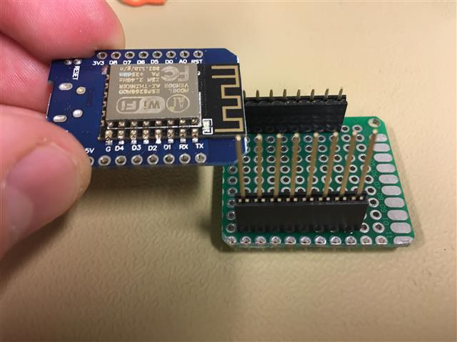  
1. Die linken 4 Pins stehen lassen.  
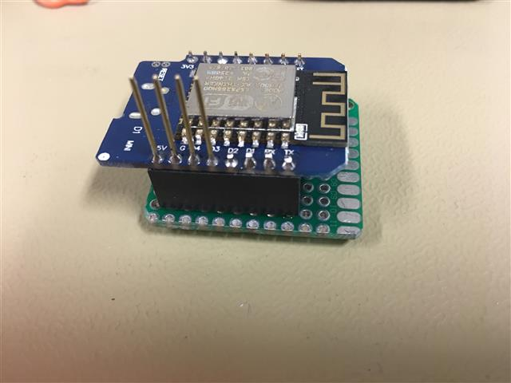  
1. Die LED des GY-521 entfernen. Die rechten 4 Pins dürfen keinen Kontakt haben.
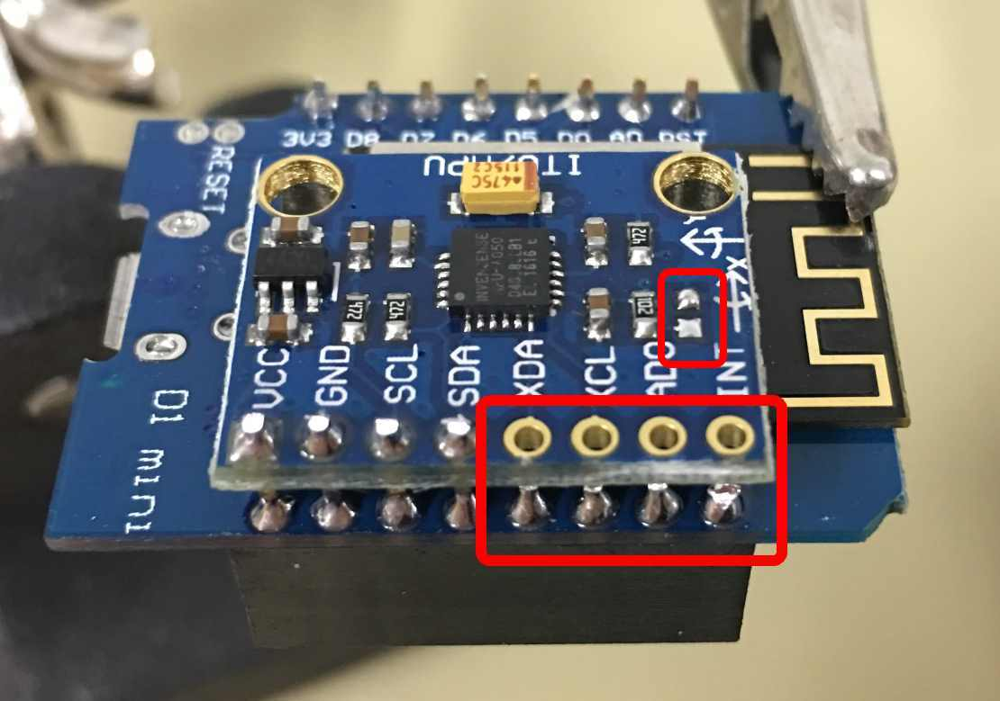  
1. Drahtbrücken, Widerstände und Schalter setzen. Oberseite anlöten macht es einfacher. 
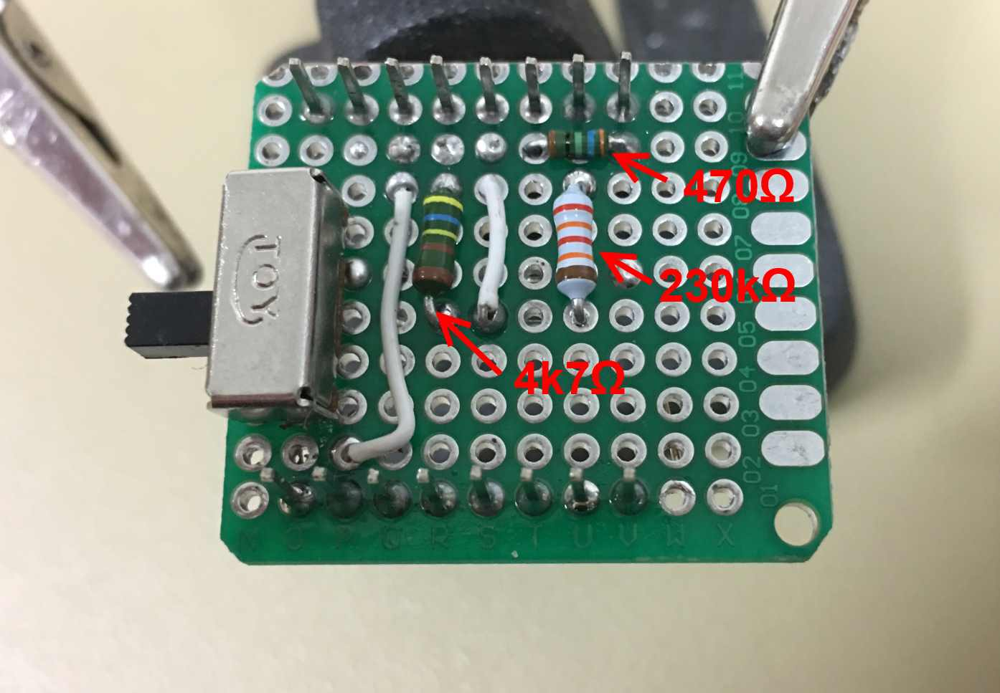  
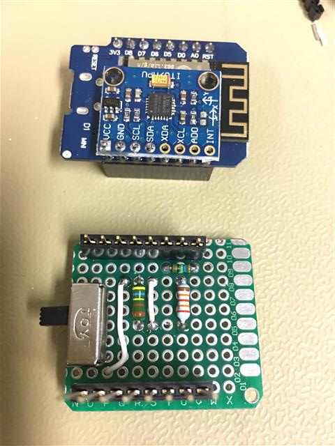  
1. Unterseite die Drähte nach folgendem Schema verdrahten. 
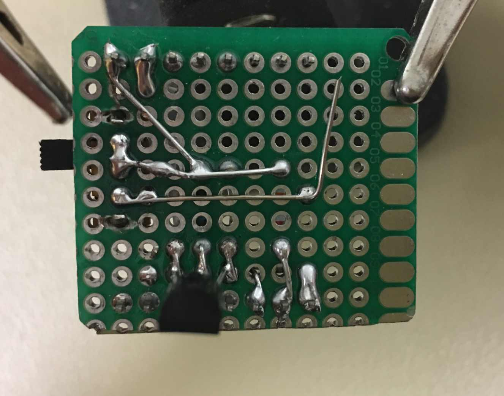  

1. Den DS18b20 anlöten, nur der mittlere Pin wird durchgebrückt von dem Widerstand auf den Pin des Wemos. Die anderen beiden (Vcc, GND) nicht an den Wemos verbinden.
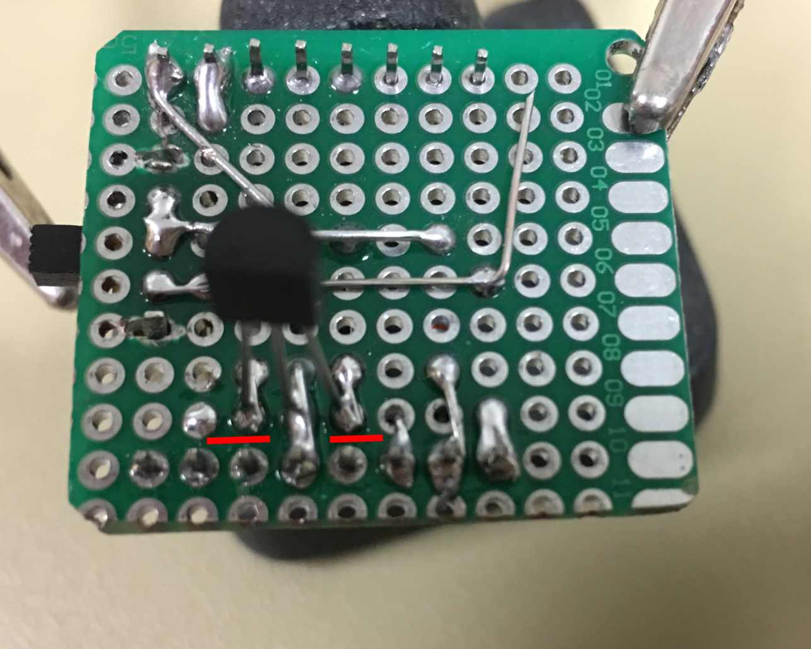  

1. Die Diode des Wemos entfernen.  
Die 4 Pins für den Lipo Laderegler TP4056 anbringen. Rot markiert sind die Verbindungen die hergestellt werden.
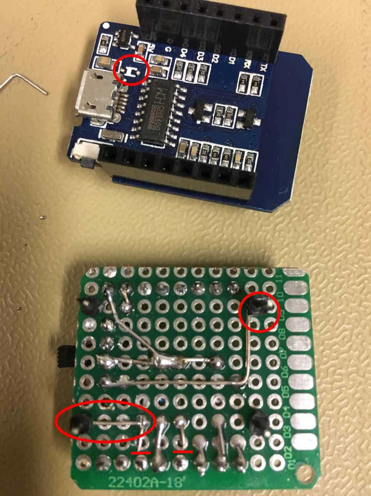  

1. Das Lademodul auflöten, der Akku wird daran angelötet.  
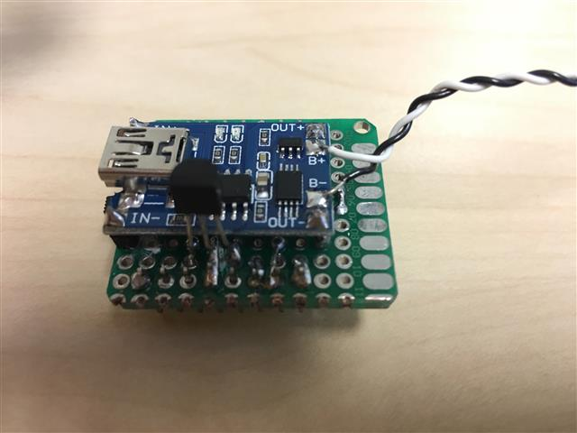  

1. Der Zusammenbaut mit dem Schlitten von unten betrachtet.  
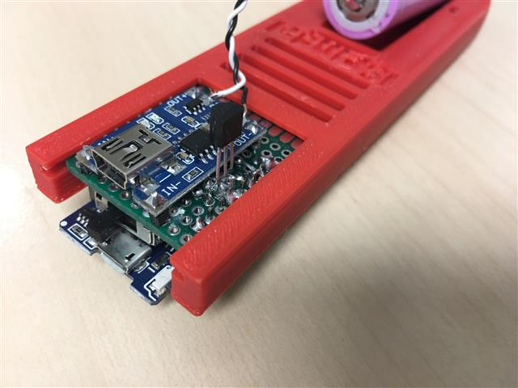  