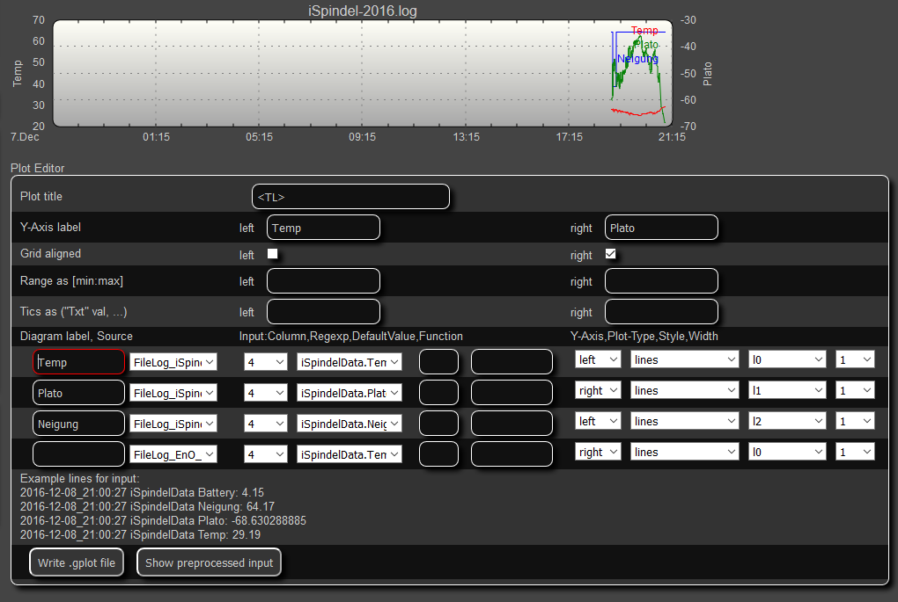

# Datenupload nach FHEM


iSpindel kann die Daten an einen lokalen [FHEM](http://fhem.de/fhem.html) Server übertragen, von wo aus sie visualisiert und weiter verarbeitet werden können ( zum Beispiel zum Steuern der Gärtemperatur).
FHEM erwartet Daten per Http Get request:

    http://server:8083/fhem?cmd.Test=set%20iSpindel%2011.5%2022.3%203.3&XHR=1

Zielhost und Port (server:8083) sowie den Namen der Spindel (hier "iSpindel") müssen im KonfigurationsUI der Spindel gesetzt werden. Alle zu Übertragenden Daten werden in der Url mit einem Get übertragen.  Die Reihenfolge ist Neigung - Temperatur - Batterie. Leerzeichen müssen durch %20 ersetzt werden.

In FHEM  (d.h. fhem.cfg) muss ein Device mit dem Namen der Spindel angelegt werden (hier: "iSpindel") sowie noch ein bisschen Perl-Logik, um den Datensatz in die Einzelwerte aufzutrennen. Die resultierenden Werte werden dem Device iSpindelData zugewiesen und können von dort weiterverarbeitet werden.


 ```
    define iSpindel dummy
    define iSpindelData dummy
    
    define iSpindel_Notify notify iSpindel {  \
     my @x= split(/\s/,ReadingsVal("iSpindel","state",0));; \
     my $Neigung=$x[0];; \
     my $Temp=$x[1];; \
     my $Battery=$x[2];; \
     my $Plato=CalcPlato($Neigung, $Temp);; \
     fhem "setreading  iSpindelData Neigung $Neigung";;\
     fhem "setreading  iSpindelData Temp $Temp";;\
     fhem "setreading  iSpindelData Battery $Battery";;\
     fhem "setreading  iSpindelData Plato $Plato";;\
    }
    
    define iSpindel_Values readingsGroup iSpindelData:Temp iSpindelData:Neigung iSpindelData:Battery iSpindelData:Plato
    attr iSpindel_Values room Bier
    
    define FileLog_iSpindel FileLog ./log/iSpindel-%Y.log iSpindelData.*
    attr FileLog_iSpindel logtype text
    
    define weblink_iSpindel SVG FileLog_iSpindel:SVG_FileLog_iSpindel_1:CURRENT
    attr weblink_iSpindel room Bier
```

Die Funktion CalcPlato(Neigung, Temperatur) kann man am besten in 99_MyUtils.pm ablegen:

```
    sub CorrectPlato($$)  #(P, T)
    {
      my $mPlato=shift;
      my $Temp=shift;
      my @k=(56.084,   -0.17885,   -0.13063);
      if ($mPlato>=5) { @k=(69.685,    -1.367,      -0.10621);};
      if ($mPlato>=10){  @k=(77.782,    -1.7288,    -0.10822);};
      if ($mPlato>=15){  @k=(87.895,    -2.3601,    -0.10285);};
      if ($mPlato>=20){  @k=(97.052,    -2.7729,    -0.10596);};
    
      my $cPlato=$k[0]+$k[1]*$Temp+$k[2]*$Temp*$Temp;
      return $mPlato-$cPlato/100;
    }
    
    sub CalcPlato($$)   #(Angle, T)
    {
      my $tilt=shift;
      my $Temp=shift;
      # Get this from Excel Calibration at 20 Degrees 
      my $mPlato=0.00438551*($tilt)*($tilt) + 0.13647658*($tilt) - 6.968821422;
      return CorrectPlato($mPlato,$Temp);
    }
```

Dir Formel für  $mPlato muss dem Kalibrierungsexcelsheet entnommen werden. Zusätzlich wird in CorrectPlato() noch eine Temperaturkorrektur des Platowertes durchgeführt  (Erfordert Kalibrierung bei 20 Grad). Die Temperaturkorrektur ist gültig für den Bereich von 5 bis 30 Grad Celsius.

Zuguterletzt muss nur noch das Diagramm für die Spindelwerte definiert werden; das geht mit dem FHEM -GPlot Editor kinderleicht und könnte in etwa so aussehen:


Damit FHEM die Diagramme mit gleitendem Zeitbereich darstellt (anstatt alle 24 Std umzuschalten) muss noch folgendes in die fhem.cfg rein:

    attr WEB endPlotNow 1


